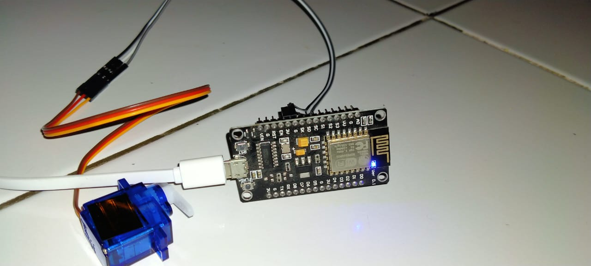

# Jarvis Project: Light Switch

This project is used to turn the light switch on and off mechanically, using a servo.

Running on a NodeMCU, connected to a MQTT Broker using the topic "jarvis/light_switch/1".

Connect Servo to NodeMCU GPIO 2, or same as D4 on the board



## Getting Started

- `git clone https://github.com/royyandzakiy/jarvis-light-switch.git`
- Open folder `jarvis-light-switch`
- Next, are you an Arduino IDE user, or Platform IO user?

### Arduino IDE

- Download [Arduino IDE](https://www.arduino.cc/en/software)
- Open folder `jarvis-light-switch-ino`, open `jarvis-light-switch-ino.ino`

### Platform IO

- Download [Visual Studio Code/VSCode](https://code.visualstudio.com/download)
- Install Extension PlatformIO

### ...Continue Getting Started

- Create file `credentials.h` and fill with the code below, fill in variables with your WIFI and MQTT settings

```
  #define CREDENTIALS_H

  const char* ssid = "WIFI_SSID";
  const char* password = "WIFI_PASS";
  const char* mqtt_server = "broker-example.com";
  const char* mqtt_user = "MQTT_USER"; // if exists
  const char* mqtt_pass = "MQTT_PASS"; // if exists
```

- Build, Upload
- Standby on your MQTT Broker, and start sending on/off messages from topic `jarvis/light_switch/1` (The `1` is meant to make it easy to add more lights, with different ID's). An alternative is to download the [MQTT Dash](https://play.google.com/store/apps/details?id=net.routix.mqttdash&hl=en&gl=US) app


---

A part of my jarvis projects series. A collection of stuff that makes life easier.
